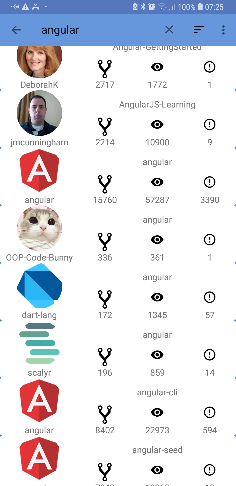
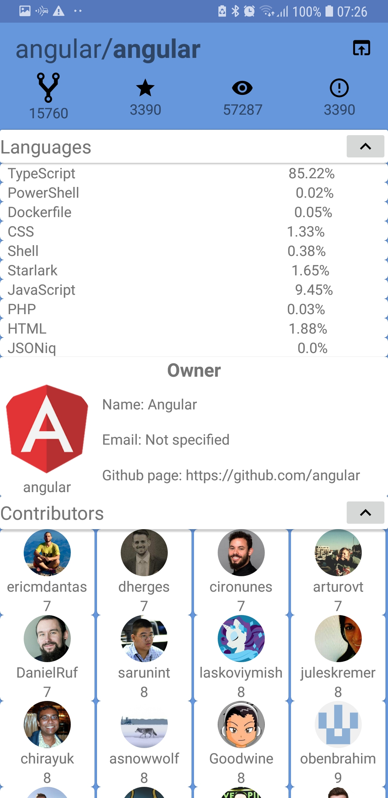
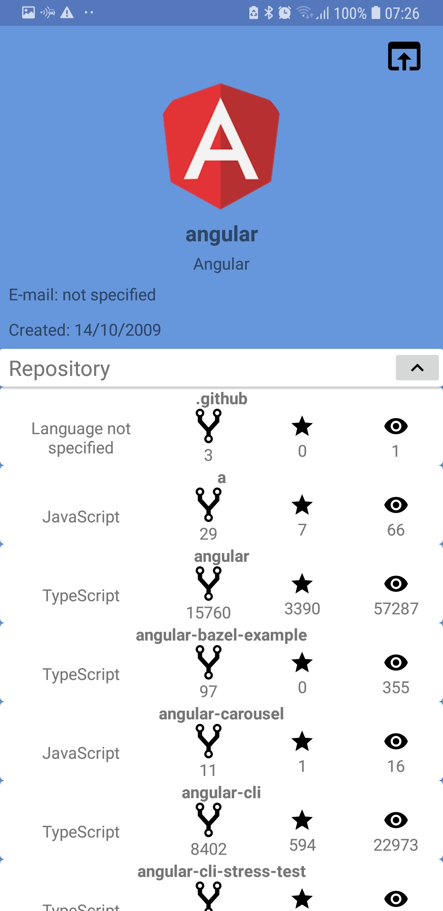

# GitHubApp

Table of contents
----
- [Preview](#preview)
- [Architecture pattern](#architecture-pattern)
- [Technologies and libraries](#technologies-and-libraries)

Preview
----

 &nbsp; &nbsp;   &nbsp; &nbsp;   

**Architecture pattern**
----
  - MVP
  
  
Technologies and libraries
----
**1. Jetpack(Most notable):**
  - Data Binding
  - Navigation component
  
**2. External libraries**
  - [RxJava 2 & RxKotlin + supporting libraries](https://github.com/ReactiveX/RxJava)
  - [Dagger 2](https://github.com/google/dagger)
  - [Glide](https://github.com/bumptech/glide)
  - [Retrofit](https://github.com/square/retrofit)
  - [Junit5](https://github.com/junit-team/junit5)
  - [MockK](https://github.com/mockk/mockk)
